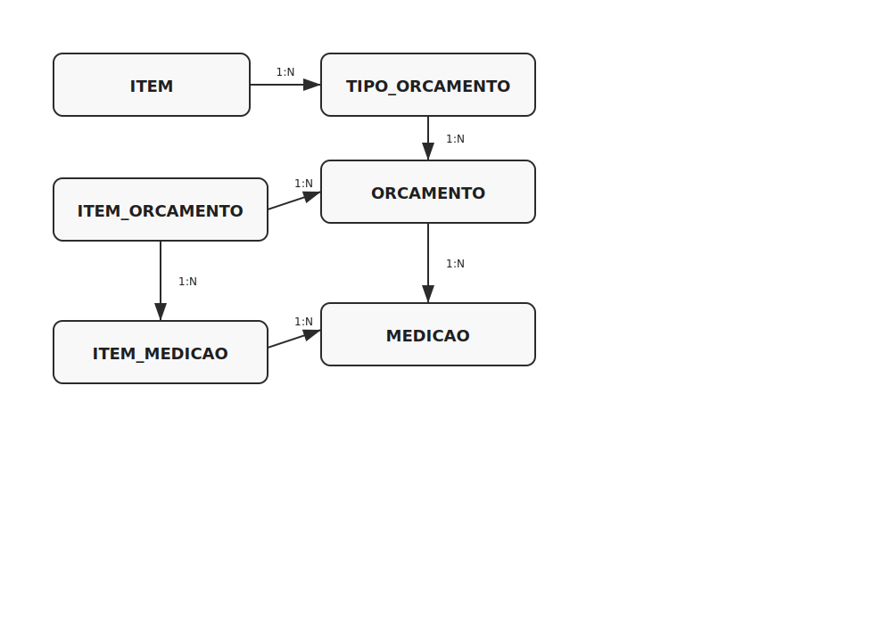

# financeiroSop-back

API de gestao de orcamentos, itens e medicoes (Spring Boot 3 + Maven).

## Execucao local
- Windows: `mvnw.cmd spring-boot:run`
- Linux/macOS: `./mvnw spring-boot:run`

A API sobe em `http://localhost:8080/financeiro`.

## Perfis
- `dev` (padrao local): H2 em memoria
- `prod`: PostgreSQL

O profile ativo e definido por `SPRING_PROFILES_ACTIVE`.

## Deploy no Render
Crie um **Web Service** apontando para este repositorio e configure:

- Runtime: `Java`
- Build Command: `./mvnw clean package -DskipTests`
- Start Command: `java -jar target/financeiroSop-back-0.0.1-SNAPSHOT.jar`

### Variaveis de ambiente no Web Service
- `SPRING_PROFILES_ACTIVE=prod`
- `PORT` (Render injeta automaticamente)

Banco (PostgreSQL do proprio Render):
- opcao 1 (recomendada): preencher no servico os envs
  - `SPRING_DATASOURCE_URL=jdbc:postgresql://<host>:<port>/<database>`
  - `SPRING_DATASOURCE_USERNAME=<user>`
  - `SPRING_DATASOURCE_PASSWORD=<password>`
- opcao 2: usar envs `PGHOST`, `PGPORT`, `PGDATABASE`, `PGUSER`, `PGPASSWORD` (tambem suportado pela app)

## Banco / schema
- Schema padrao em producao: `financeiro`
- Hibernate: `spring.jpa.hibernate.ddl-auto=update`

## Fluxograma do banco

