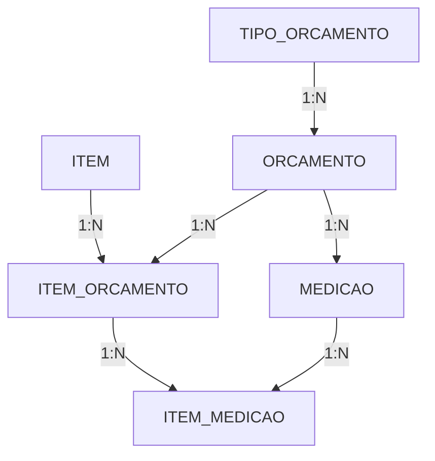

# Fluxograma do Banco

```mermaid
flowchart TD
  item[ITEM] -->|1:N| item_orcamento[ITEM_ORCAMENTO]
  orcamento[ORCAMENTO] -->|1:N| item_orcamento
  tipo_orcamento[TIPO_ORCAMENTO] -->|1:N| orcamento
  orcamento -->|1:N| medicao[MEDICAO]
  item_orcamento -->|1:N| item_medicao[ITEM_MEDICAO]
  medicao -->|1:N| item_medicao
```
